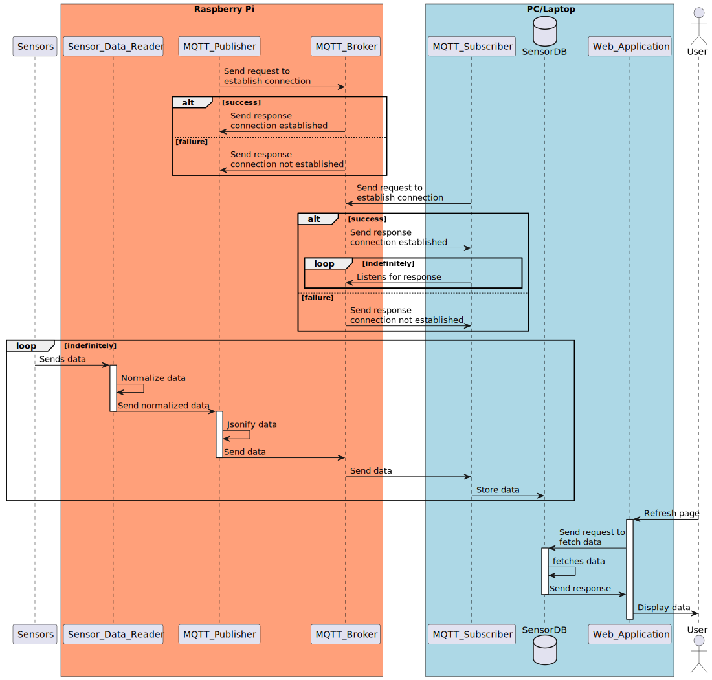

# Raspberry Pi 5 Weather Station
# Table of Contents
- [Overview](#overview)
- [Requirements](#requirements)
    - [Hardware](#hardware)
    - [Software](#software)
- [Design](#design)
    - [Sensor Component Diagram](#sensor-component-diagram)
    - [Sequence Diagram](#sequence-diagram)
- [Implementation](#implementation)
    - [Project Structure](#project-structure)
    - [Sensors](#sensors)
    - [MQTT](#mqtt)
        - [Broker](#broker)
        - [Publisher](#publisher)
        - [Subscriber](#subscriber)
    - [Web Application](#web-application)
        - [Frontend](#frontend)
        - [Database](#database)


# Overview
The Raspberry Pi Weather Station is a project that utilizes sensors as well as communication protocols to gather weather data and send across a network. It is split into 3 main segments, namely: the sensors, the MQTT service and the web application.

What follows is a description of the 3 segments as well as their implementation and usage instructions

# Requirements
Below is a list of hardware and software used and their usage in the project.
## Hardware
| Name | Usage |
| ---- | ----- |
| DHT11 Sensor | Used to collect temperature and humidity data |
| LDR Photosensitive Sensor | Used to collect light luminosity data |
| Raindrop Sensor | Used to collect rain volume data |
| breadboard | Used to connect the Raspberry Pi with the sensors and analog-to-digital converter |
| MCP3008 ADC | Used to convert the analog readings of the DHT11 and LDR Photosensitive sensors to digital |
| Raspberry Pi 5 | Used to receive converted analog sensor readings and normalize them. Also used to host the MQTT broker and act as the MQTT publisher |

## Software
| Name | Usage |
| ---- | ----- |
| gpiozero Library | Used to get the LDR Photosensitive and Raindrop sensors readings |
| adafruit_dht Library | Used to get the DHT11 sensor readings |
| paho-mqtt Library | Used to initiate the publisher and the subscriber |
| Mosquitto MQTT Broker | Used to send data from the publisher (Raspberry Pi 5) to the subscriber (PC, for instance) |
| Django Web Framework | Used to run a web application that displays the data in graphs |
| ChartsJS Library | Used to make charts that represent the data received |

# Design
## Sensor Component Diagram

In the diagram above, 3 sensors are present, the raindrop sensor, LDR photosensitive sensor and the DHT11 sensor. As it can be seen, they are all connected to the breadboard power rail using their `VCC` and `GND` pins.

However, the DHT11 sensor differs from the other 2 and that is due to its `DATA` output pin being connected directly to the `GPIO22` pin in the Raspberry Pi. This is because the DHT11 sensor has a built-in analog-to-digital converter. The `A0` pins in the other 2 sensors are connected to channels 6 and 7 of the MCP3008, which is an analog-to-digital converter.

The converter is then connected to various pins shown in the diagram to the Raspberry Pi. 

Finally, the breadboard is powered by the Raspberry Pi using its `3v3 Power` and `GND` pins.

## Sequence Diagram

In the digram above, both the `MQTT Publisher` and `MQTT Subscriber`, which are present in the Raspberry Pi and PC/Laptop respectively, send requests to the MQTT Broker (hosted by the Raspberry Pi) to establish a connection. In case of a failure, the broker sends an error message with an error code to either or both. If successful, the subscriber starts listening for any published data.

Once a connection is established, the sensor reader script starts running and receives sensor data. Some of the data received may need to be normalized first before being sent to the publisher, so it is the reader's job to do so. Once done, the data is then sent to the publisher and is converted to a JSON format. 

The data is then sent to the broker which then sends it to the subscriber. The subscriber sends the data to a database for storage, so that whenever the user decides to use the web application, the data is readily present on load or after refreshing.

# Implementation
## Project Structure
```bash
.
├── project
│   ├── manage.py
│   ├── project
│   │   ├── __init__.py
│   │   ├── asgi.py
│   │   ├── settings.py
│   │   ├── urls.py
│   │   └── wsgi.py
│   ├── sensors
│   │   ├── __init__.py
│   │   ├── admin.py
│   │   ├── apps.py
│   │   ├── management
│   │   │   ├── __init__.py
│   │   │   └── commands
│   │   │       ├── __init__.py
│   │   │       └── subscribe.py
│   │   ├── migrations
│   │   │   ├── 0001_initial.py
│   │   │   └── __init__.py
│   │   ├── models.py
│   │   ├── templates
│   │   │   └── sensors
│   │   │       ├── logs.html
│   │   │       └── sensors.html
│   │   ├── tests.py
│   │   ├── urls.py
│   │   └── views.py
│   └── templates
│       └── base.html
├── requirements.txt
└── rpi
    ├── Sensor
    │   ├── __init__.py
    │   ├── normalize.py
    │   └── sensor.py
    ├── publisher.py
    └── run.sh
```

## Sensors
In order to receive the data from the sensors, the functions in `sensor.py` script in the `rpi/Sensor` submodule are called. These functions utilize the `gpiozero`, `adafruit_dht` and `board` libraries to get the data from the sensors.

The functions for the raindrop and LDR photosensitive sensors use the `MCP3008` method from the `gpiozero` to access the data and a `channel_number` parameter based on the channels on the MCP3008 converter.

The function for the DHT11 sensor use the `DHT11` method from the `adafruit_dht` library to access the data and the `D22` method from the `board` library to specify the GPIO pin connected to the sensor.

If ran independent of the system, the script returns these outputs:

```python title="sensor.py"
#For the rain and light sensors
from gpiozero import MCP3008

#For the temperature and humidity sensor
import board
import adafruit_dht

def rain(channelNumber):
    return MCP3008(channel = channelNumber)

def light(channelNumber):
    return MCP3008(channel = channelNumber)

def humidity_temperature():
    return adafruit_dht.DHT11(board.D22, use_pulseio = False)

while True:
    print(rain(7).value)
    print(light(6).value)
    print(humidity_temperature().humidity)
    print(humidity_temperature().temperature)
```
```bash title="output"
➜  project python demo/sensor.py
0.9794821690278457
0.14997557401074735
50
26
0.9785051294577429
0.14899853444064481
50
26
```

As it can be seen above, the output of the rain and light functions is unintelligable to humans, which is why, the `normalize` function in the `normalize.py` script is used. Below is the output of the function:

```python title="normalize.py"
def normalize(value):
    return 100 * abs(value - 1)
```
```python title="sensor.py"
#For the rain and light sensors
from normalize import normalize
from gpiozero import MCP3008

#For the temperature and humidity sensor
import board
import adafruit_dht

def rain(channelNumber):
    return MCP3008(channel = channelNumber)

def light(channelNumber):
    return MCP3008(channel = channelNumber)

def humidity_temperature():
    return adafruit_dht.DHT11(board.D22, use_pulseio = False)

while True:
    print(normalize(rain(7).value))
    print(normalize(light(6).value))
    print(humidity_temperature().humidity)
    print(humidity_temperature().temperature)
```
```bash title="output"
➜  demo python sensor.py
1.660967269174396
85.00244259892527
49
26
1.660967269174396
85.00244259892527
50
26
```

Pictured below is the Raspberry Pi sensor setup. A more detailed diagram is present in the previous [section](#sensor-component-diagram) showing the various pin connections between the sensors, the converter and the Raspberry Pi.


## MQTT
### Broker
Once the sensor data is acquired, there has to be a method to send the data across the network to other devices. In this case, an MQTT services named `Mosquitto` was used to initialize an MQTT broker, where the Raspberry Pi as its host. This is done by editing the `address` variable to the Raspberry Pi's public ip in the `mosquitto.conf` file in the `/etc/mosquitto/conf.d` directory.

```bash title="mosquitto.conf"
bind_address 192.168.77.104

allow_anonymous false
password_file /etc/mosquitto/passwd

acl_file /etc/mosquitto/acls
```

To run the service, this command was used: `sudo systemctl start mosquitto.service`.

### Publisher
Now that the service is running, there needs to be a publisher that can take the data from the sensors and publishes it in the network. Here the `paho-mqtt` library was used to initialize the Raspberry Pi as a publisher. 

At the very beginning of the `publisher.py` script in the `rpi` directory, the `broker`, `port` and `topic` variables were initialized to match that of the broker and will be used as parameters for the `Client` object to create a connection between the broker and the publisher (client). 

The `connect_mqtt` function initializes a new `Client` object instance from the `paho-mqtt` library while the `on_connect` function uses the instance attributes to check if a connection can be made. If so, then the `connect_mqtt` function returns the created `Client` object instance.

The `get_sensor_data` function simply takes the data from the sensors and converts them into a JSON format.

The `publish` function takes the jsonified data and uses it as a parameter in the `Client` instance's `publish` function to be sent. The function loop 5 times and then stops.

Finally, the `run` function connects the publisher to the broker and begins a loop for the `publish` function to run.

```python title="publisher.py"
from json import dumps
from paho.mqtt import client as mqtt_client
from time import sleep 
from random import randint

from Sensor.sensor import rain, light, humidity_temperature
from Sensor.normalize import normalize

broker = '192.168.77.104'
port = 1883
topic = 'sensor/data'
client_id = f'publish-{randint(0, 1000)}'

def connect_mqtt():
    def on_connect():
        if rc == 0:
            print("Connected to MQTT broker")
        else:
            print('Failed to connect, return code {rc}\n')

    client = mqtt_client.Client(client_id)
    client.username_pw_set('test-publish', '12345aass')
    client.on_connect = on_connect
    client.connect(broker, port)
    return client

def get_sensor_data():
    rainValue = normalize(rain(7).value)
    lightValue = normalize(light(6).value)
    humidityValue = humidity_temperature().humidity
    temperatureValue = humidity_temperature().temperature

    values = {
        "rain":rainValue, 
        "light":lightValue,
        "humidity":humidityValue,
        "temperature":temperatureValue,
    }

    return dumps(values)

def publish(client):
    msg_count = 1
    while True:
        data = get_sensor_data()

        msg = str(data)
        result = client.publish(topic, msg)
        status = result[0]
        if status == 0:
            print("sent")
        else:
            print(f"Failed to send message to topic {topic}")
        
        msg_count += 1
        if msg_count > 5:
            break

        sleep(1)

def run():
    client = connect_mqtt()
    client.loop_start()
    publish(client)
    client.loop_stop()

if __name__ == "__main__":
    run()
```

```bash title="output"
➜  project ./run.sh
Connected to MQTT Broker!
sent
sent
sent
sent
sent
```

> NOTE: Due to an error that stops the publisher script after 7 responses, we had to improvise and limit the `publish` function to 5 iterations and then use a `run.sh` bash script that runs the script every 10 seconds to give an illusion of continuity.

### Subscriber
Although, the `subscriber.py` script does not differ from the `publisher.py` as they both use the same library and the same functions to initalize a client, the `subscriber.py` script, however, uses the `subscribe` function to acquire the published data. In the same function, the data is stored in the database using the Django `SensorData.object.create` function imported from the `models.py` script in the `project/sensors` directory, where the table was made for the data in the database.

```python title="subscriber.py"
from paho.mqtt import client as mqtt_client
from ...models import SensorData
from random import randint
from json import loads
from django.core.management.base import BaseCommand

broker = '192.168.77.104'
port = 1883
topic = 'sensor/data'
client_id = f'subscribe-{randint(0, 100)}'

class Command(BaseCommand):
    help = 'Starts the MQTT subscriber'

    def handle(self, *args, **kwargs):
        def connect_mqtt() -> mqtt_client:
            def on_connect(client, userdata, flags, rc):
                if rc == 0:
                    print("Connected to MQTT Broker!")
                else:
                    print("Failed to connect, return code %d\n", rc)

            client = mqtt_client.Client(client_id)
            client.username_pw_set('test-subscribe', '12345aass')
            client.on_connect = on_connect
            client.connect(broker, port)
            return client

        def subscribe(client: mqtt_client):
            def on_message(client, userdata, msg):
                data = loads(msg.payload.decode())
                SensorData.objects.create(
                    rain = data['rain'],
                    light = data['light'],
                    humidity = data['humidity'],
                    temperature = data['temperature']
                )

                print(f"Data saved: {data}")

            client.subscribe(topic)
            client.on_message = on_message

        client = connect_mqtt()
        subscribe(client)
        client.loop_forever()
```

```bash title="output"
Connected to MQTT Broker!
Data saved: {'rain': 1.856375183194925, 'light': 85.00244259892527, 'humidity': 55, 'temperature': 28}
Data saved: {'rain': 1.856375183194925, 'light': 85.00244259892527, 'humidity': 55, 'temperature': 27}
Data saved: {'rain': 1.856375183194925, 'light': 85.19785051294578, 'humidity': 55, 'temperature': 28}
Data saved: {'rain': 2.344894968246214, 'light': 85.29555446995603, 'humidity': 55, 'temperature': 27}
Data saved: {'rain': 1.7586712261846715, 'light': 85.00244259892527, 'humidity': 55, 'temperature': 28}
```

## Web Application
For the web application, Django was used for its ease of use and batteries-included approach
### Frontend
There are only three HTML files used in this project: `base.html`, `sensors.html` and `logs.html`.

The `base.html` acts as a template for the other two files and has a navigation bar between the pages. Additionally, the file was used to import the CDN of both `bulma`, which is used for styling, and `chartJS`, which is used to create charts.


The `sensors.html` contains the charts made using `chartJS` associated with the data. Each chart is an HTML canvas with various options, such as `label`, `datasets`, `data`, `bacgroundColor`, etc. 

Of all these options, the most important are the `labels` and `data` options which are initalized to {{ data.label }} and {{ data.rain }} (for instance). This is done so because in the `views.py` script in the `project/sensors` directory, the function `index` returns the data stored in the database as a response whenever the page is access or refreshed. The data is then used datapoints for the charts.


The same way the charts in `sensors.html` file acquire the data, `logs.html` display the data in a tabular format


